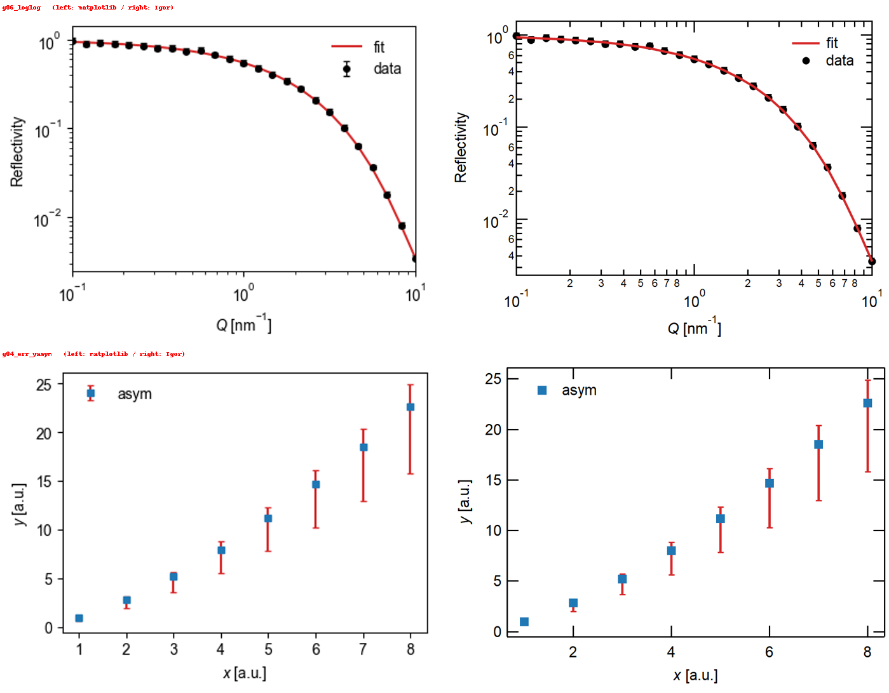
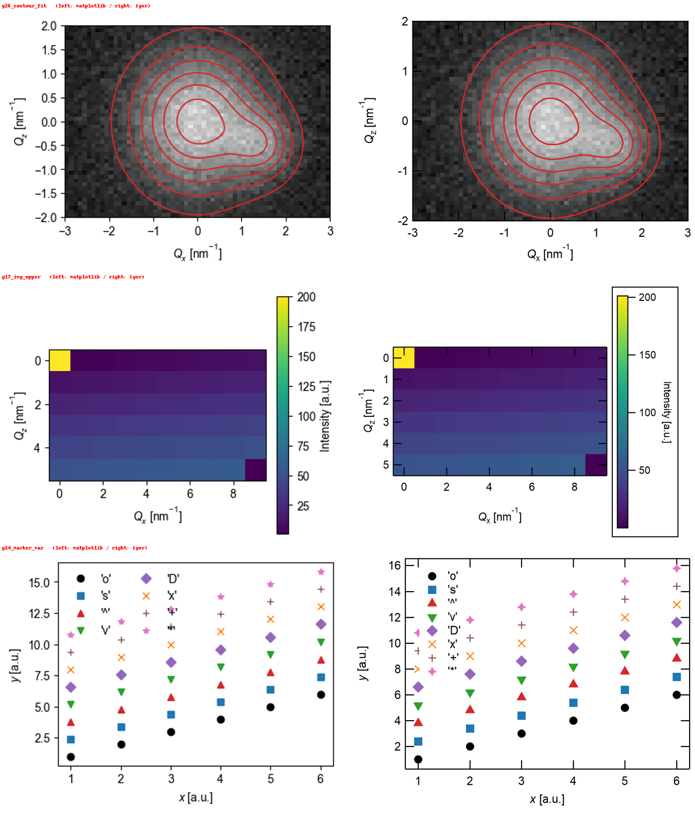

# export-igorgraph

**Turn a matplotlib figure into an Igor Pro graph — the same look, editable in Igor.**

`export_igor(fig, outdir, name)` writes one HDF5 file (`name.h5`) containing the real data and the Igor drawing commands.
In Igor you load it with `LoadPythonFigure()` — no per-figure procedure files.

[日本語の README](README.ja.md)



## Why

Analysis and quick plotting often happen in Python; the publication-quality graph (and the collaborators' habits) live in Igor Pro.
Re-drawing by hand loses time and consistency. This tool reproduces what matplotlib shows — data, axes, log scales, markers, dashes,
error bars with caps, legends, labels, images, color scales and **contours** — as a native Igor graph that you can keep editing in Igor.

- **Native Igor objects**: traces, images, `ColorScale`, and real Igor contours (`AppendMatrixContour`/`ModifyContour`) built from the original Z matrix.
- **Looks like the matplotlib figure, not "roughly"**: sizes, dash patterns, marker outlines, error-bar caps and label positions were *measured* on Igor and calibrated.
- **Nothing is dropped silently**: whatever Igor cannot reproduce is reported in `report.warnings`.
- **Safe to open**: the Igor loader runs only commands that match a strict allow-list, and rejects the whole file if any command does not.
- **No extra Igor XOPs, no Python in Igor** (works with Igor 8; Python is only needed to create the `.h5`).

## First: install the loader in Igor (once)

To load graphs, Igor needs the fixed loader `ExportIgorGraphLoader.ipf` (in `igor/` of this repository; `python -m export_igorgraph loader <folder>` also writes it).

1. Copy `ExportIgorGraphLoader.ipf` into (Windows):
   `Documents\WaveMetrics\Igor Pro 8 User Files\Igor Procedures\`
   - **Files there are loaded automatically when Igor starts** (this is the way that was tested).
   - If you prefer not to auto-load it, put it in `...\Igor Pro 8 User Files\User Procedures\` and load it when needed (`File > Open File > Procedure…`, or `#include "ExportIgorGraphLoader"` in the procedure window). This route is untested in this project.
2. Restart Igor (needed if Igor is already running).
3. Check that `LoadPythonFigure` appears in the **Macros** menu. If not, look for compile errors in the procedure window.
4. To load a figure: `Macros > LoadPythonFigure`, or run `LoadPythonFigure()` on the command line, and pick the `.h5`.

(`LoadPythonFigure` is a macro that just calls the function `LoadPythonFigure_exec()`. To give a path directly, call the function: `LoadPythonFigure_exec(h5Path="C:\\folder\\fig1.h5")`.)

## Quick start

```
pip install git+https://github.com/nlyamada/export-igorgraph      # or: pip install .  from a clone
```

```python
import export_igorgraph                                 # import BEFORE contour(): see "Contours"
from export_igorgraph import export_igor
import matplotlib.pyplot as plt

fig, ax = plt.subplots(figsize=(4, 3))
ax.errorbar(q, R, yerr=dR, fmt="o", color="k", ms=4, capsize=2, label="data")
ax.plot(q, R_fit, "-", color="tab:red", lw=1.5, label="fit")
ax.set_xscale("log"); ax.set_yscale("log")
ax.set_xlabel(r"$Q$ [nm$^{-1}$]"); ax.set_ylabel("Reflectivity")
ax.legend(loc="upper right", frameon=False)

report = export_igor(fig, "out", "fig1")                # → out/fig1.h5
print(report.summary())                                 # warnings for anything Igor cannot reproduce
```

In Igor: `LoadPythonFigure()` and pick `fig1.h5`.

### Formatting: your own defaults

The main settings are plain `style=` entries — `tick`, `mirror`, `standoff`, `grid`, `width`, `height`, `font`, `gFont`:

```python
export_igor(fig, "out", "fig1", style={"tick": 0, "grid": 1, "width": 300, "height": 200})
```

Settings you always want can live in a JSON file (`export_igorgraph_style.json` in the current folder or `~/.export_igorgraph_style.json`; see `export_igorgraph_style.example.json`). Unknown keys warn, invalid values raise an error. All keys: [docs/en/usage.md](docs/en/usage.md).

### Contours over an image (e.g. a fit over 2-D data)

```python
ax.imshow(data, extent=(x0, x1, y0, y1), origin="lower", cmap="gray", aspect="auto")
ax.contour(X, Y, fit, levels=levels, colors="tab:red", linewidths=1.2)
export_igor(fig, "out", "fig_fit")      # the contour becomes an Igor contour; change levels/colors later with ModifyContour
```

matplotlib does not keep the Z matrix of a contour set. `import export_igorgraph` wraps the public `Axes.contour`/`contourf` to remember `(X, Y, Z)` at call time;
if a contour was drawn earlier, pass `export_igor(..., contour_data=(X, Y, Z))`. Requires matplotlib ≥ 3.8.



## How it works

```
matplotlib Figure ──export_igor()──▶ name.h5 (waves + commands) ──Igor: LoadPythonFigure()──▶ Igor graph
                                       │
                                       └─ the loader checks every command against an allow-list, then runs them
```

## Status

- Verified on **Igor Pro 8.04, Windows**. Other Igor versions and macOS are untested (reports welcome).
- Python 3.9+; matplotlib 3.6–3.10 pass the test suite (contours need ≥ 3.8).
- What is supported, what is not, and known differences: [docs/en/supported.md](docs/en/supported.md).
- How everything was verified and calibrated: [docs/en/verified.md](docs/en/verified.md).
- The default layout is a compact single-column style (8 cm plot width, Arial, inside ticks). Use `use_mpl_size=True` to take sizes from the matplotlib figure, or override anything via `style=`.

## Safety

A `.h5` carries commands that Igor executes, so the loader only runs commands that fully match a strict allow-list; if any command is rejected, nothing is loaded.
See [docs/en/safety.md](docs/en/safety.md) for the design and its limits, and [SECURITY.md](SECURITY.md) to report a problem.

## Use with Claude

`plugin/` is a Claude Code plugin (and the same skill can be packaged for Claude.ai): ask Claude to "draw this in Igor" and it writes the matplotlib code, runs `export_igor`, and — in Claude Code on Windows — can drive Igor to compare the result.

```
/plugin marketplace add nlyamada/export-igorgraph
/plugin install export-igorgraph@export-igorgraph
```

## Documentation

[Usage](docs/en/usage.md) · [Supported features](docs/en/supported.md) · [Safety](docs/en/safety.md) · [Verification](docs/en/verified.md) · [Driving Igor automatically](docs/en/igor-automation.md) · [Developing](docs/en/developing.md) · [日本語ドキュメント](docs/ja/)

## License

MIT — see [LICENSE](LICENSE).

*Igor Pro is a product and trademark of WaveMetrics, Inc. This project is independent and not affiliated with or endorsed by WaveMetrics.*
